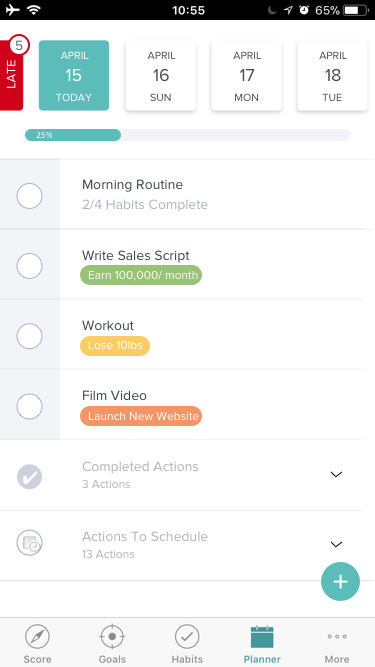

# Progress Bar

In this project we're updating the progress bar to look like the design
in the mockup.

We're already really close, but specifically we need you to:

* Remove the border around the bar
* Print the progress percentage inside the bar
* Only show the text inside the bar if the progress will be past it

To clarify that last request.  When the bar is a low number like <10
we don't want to show the percentage in the bar.

If there is a way to handle this automatically with CSS that would be great
otherwise we can set a number minimum to show the text.
